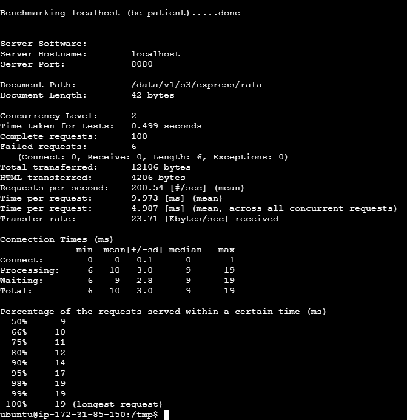

# POC S3
Consuming S3 objects of 6KB size from Kotlin application in order to check the latency from consumer side to expose as REST resource.

## Tryouts
The apache benchmarking tool have been used in order to generate the traffic towards the app endpoint.
- https://httpd.apache.org/docs/2.4/programs/ab.html
- App repo: https://github.com/rafaelcoelho/poc-aws-s3

### US_EAST_1 Localhost Actuator

### SA_EAST_1 to US_EAST_1 Actuator
The additional latency was abount 200ms

### SA_EAST_1 to S3 General Purpose in localhost

### US_EAST_1 to S3 General Purpose in localhost

### SA_EAST_1 to S3 Express in localhost

### US_EAST_1 to S3 Express in localhost

